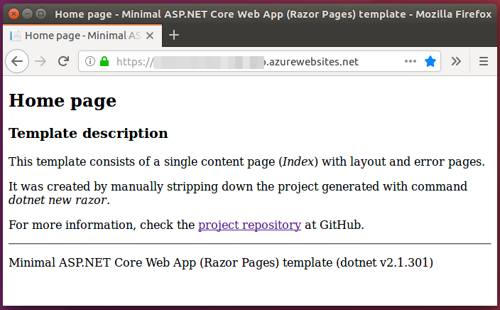

# Minimal ASP.NET Core Web App (Razor Pages) template

This template consists of a single content page (`Index`) with layout and error pages. For information
about the remaining pages and code files, see the article 
[Get started with Razor Pages in ASP.NET Core](https://docs.microsoft.com/en-us/aspnet/core/tutorials/razor-pages/razor-pages-start?view=aspnetcore-2.1#project-files-and-folders) or the README file of
[MiniRazor.Template](https://github.com/mlafleur/MiniRazor.Template#project-structure) (more about this repository below).

## Background

I needed to create a basic Web application - a single page with a few controls and an API call. 
I enjoyed working with Azure Functions, the related [Core Tools](https://github.com/Azure/azure-functions-core-tools)
package and VS Code, seemlessly switching between Windows and Ubuntu machines.

Since my first [serverless endavour](https://github.com/chopeen/last-fm-not-mine-alert-func) was so successful and
I read about Razor Pages a few times recently, I decided to use .NET Core for the Web application, too.

## New project

I installed .NET Core SDK (v2.1.301), executed `dotnet new razor` and saw a new project that was way more complex
than I expected. You can check the [inital import](/tree/a2e71aec1537bc803707a1eded2013a1c6d8eed4) [TODO: fix the relative link!] to see what 
I mean - I was needed a simple scaffolding and got a full-blown application.

I looked for a `dotnet new razor` option to generate a more basic project, but - finding none - I decided to strip
it down to bare minimum manually. This is why this repository was created.

During this reasearch, I somehow missed [MiniRazor.Template](https://github.com/mlafleur/MiniRazor.Template) that
I highly recommend:

 - it allows to to generate a NuGet package and install it locally,
 - the template includes [even fewer files](https://github.com/mlafleur/MiniRazor.Template/tree/master/content)
   than mine,
 - the role of every file is [explained](https://github.com/mlafleur/MiniRazor.Template#project-structure).

## The road to the minimal template

I looked for unimportant elements, removed them and then removed unreferenced pieces left behind:

- libraries:
  - Bootstrap
  - jQuery 
- pages:
  - `_ValidationScriptsPartial` (a reference to the jQuery validation scripts removed earlier)
  - `Contact`
  - `About`
  - `Privacy` (along with some cookie consent code)
- images
- most of CSS styling

I kept the directory structure inside `wwwroot`.

## Publishing to Azure

 Out of different deployment options available for Web apps, I picked Local Git Repository (local from the perspective
 of the app, i.e. in the Azure cloud). After initial configuration, I run `git push azure master` on my computer and 
 the latest version is deployed.

 For details, refer to the article [Publishing a Web Core app to Azure with CLI](https://docs.microsoft.com/en-us/aspnet/core/tutorials/publish-to-azure-webapp-using-cli?view=aspnetcore-2.1&tabs=other).

## TODO
  1. Rename the repository
  1. Add tags, description, etc
  1. ~~Explain why a stripped-down template was created and how it was done~~
   - ~~commands~~
   - ~~dotnet version~~
   - ~~contents (1 page + layout + error page + ...)~~
   - ~~screenshot~~
  1. Once ready, replace _Lorem Ipsum_ with the above description
  1. ~~Add information about publishing to Azure~~
